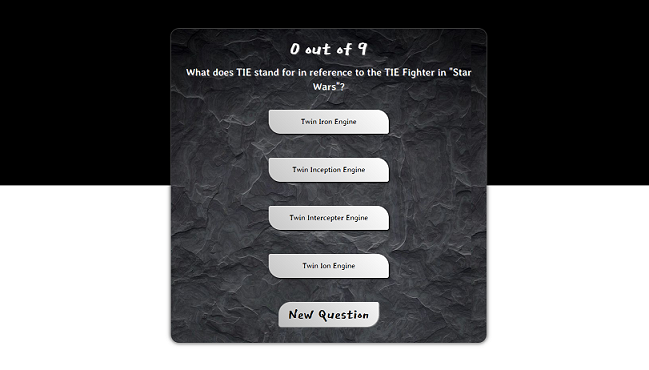

# Quiz Game
kateeliza29.github.io/QuizGame

## Introduction
This project was created in April 2020. It is a simple trivia game that uses the Open Trivia API to provide the questions.

## Technologies Used
* HTML
* CSS
* JavaScript

## Scope and Improvements
Currently, the user can select the amount of questions they would like to answer. If the user answers the question correctly, the answer highlights in green. If the user answers incorrectly, the answer highlights in red and the user may choose another answer. As the user answers correctly, the score count increases. Once the questions run out, the final score displays.  
 
If I were to take this project further, I would do the following:
* Use the full extent of the API's functionality by allowing the user to select their topic, difficulty and question format, as well as the number of questions. 
* Look into the possibility of making it a multiplayer app. 

## Screenshot

